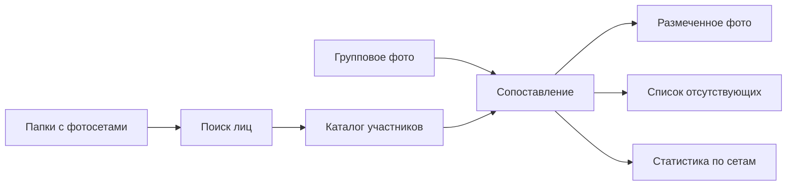

<div align="center">

# 👤 FaceFinder GUI

**Локальная сверка людей на групповом фото с фотографиями из нескольких сетов**

[](https://www.python.org/)
[](https://doc.qt.io/qtforpython-6/)
[](https://github.com/deepinsight/insightface)
[](#установка-и-запуск)

FaceFinder помогает быстро понять, кто присутствует на общем снимке, кого не хватает и какие лица не удалось уверенно распознать. Фотографии обрабатываются локально на компьютере.

</div>

---

## Возможности

| | |
|---|---|
| 🔎 **Поиск и сопоставление лиц** | Находит лица и сравнивает их с автоматически собранным каталогом людей |
| 📂 **Работа с несколькими сетами** | Анализирует отдельные папки с фотографиями и сравнивает их состав |
| 📊 **Отчёт по участникам** | Показывает присутствующих, отсутствующих и неизвестные лица |
| 🖼️ **Разметка группового фото** | Рисует рамки, ID и уровень уверенности распознавания |
| 💾 **Экспорт результата** | Сохраняет размеченный снимок или копирует его в буфер обмена |
| 🔒 **Локальная обработка** | Исходные фотографии не отправляются во внешние сервисы |

## Как это работает



1. Выберите групповую фотографию.
2. Укажите корневую папку, внутри которой находятся папки отдельных фотосетов.
3. Запустите анализ и сохраните готовый отчёт.

## Подготовка фотографий

Каждая вложенная папка считается отдельным сетом. Названия папок используются в итоговой аналитике.

```text
photo_sets/
├── backstage/
│   ├── photo_01.jpg
│   └── photo_02.jpg
├── ceremony/
│   ├── photo_01.jpg
│   └── photo_02.jpg
└── portraits/
    ├── photo_01.jpg
    └── photo_02.jpg
```

Поддерживаются изображения `JPG`, `JPEG`, `PNG`, `WEBP`, `BMP`, `TIF` и `TIFF`. Для построения каталога приложение выбирает наиболее уверенно найденное лицо на каждом снимке, поэтому лучше использовать фотографии, где главный человек хорошо виден.

## Установка и запуск

Понадобятся [Python](https://www.python.org/downloads/) 3.10 или новее и `pip`. Для наиболее предсказуемой установки рекомендуется Python 3.10 или 3.11.

```bash
git clone https://github.com/ayojoydev/FaceFinderGui.git
cd FaceFinderGui

python -m venv .venv
```

Активируйте виртуальное окружение:

```powershell
# Windows PowerShell
.\.venv\Scripts\Activate.ps1
```

Установите зависимости и запустите приложение:

```powershell
python -m pip install --upgrade pip
pip install -r requirements.txt
pip install onnxruntime
python main.py
```

> [!NOTE]
> При первом анализе InsightFace может скачать модель `buffalo_l`. Для этого запуска потребуется подключение к интернету; последующая обработка выполняется локально.

## Результаты анализа

- **IDxx** — лицо уверенно сопоставлено с участником каталога;
- **? IDxx** — найдено вероятное совпадение с низкой уверенностью;
- **UNKNOWN** — лицо не удалось сопоставить с каталогом;
- **отсутствующие** — участники каталога, которых нет на групповом фото;
- **аналитика по сетам** — различия между составом группового фото и каждым фотосетом.

Размеченное изображение автоматически создаётся в `out_report/group_annotated.jpg`. Его также можно сохранить в другое место или скопировать в буфер обмена прямо из интерфейса.

## Технологии

- [InsightFace](https://github.com/deepinsight/insightface) — детекция лиц и эмбеддинги;
- [OpenCV](https://opencv.org/) — чтение, обработка и разметка изображений;
- [scikit-learn](https://scikit-learn.org/) — агломеративная кластеризация лиц;
- [PySide6](https://doc.qt.io/qtforpython-6/) — графический интерфейс;
- [NumPy](https://numpy.org/) — вычисления и сравнение векторов признаков.

## Ограничения

Качество результата зависит от освещения, ракурса, разрешения и видимости лиц. Автоматическое распознавание может ошибаться, поэтому отчёт следует использовать как вспомогательный инструмент и проверять визуально. Обрабатывайте биометрические данные только с согласия изображённых людей и в соответствии с применимыми правилами.

## Планы

- [ ] добавить демонстрационный скриншот или GIF;
- [ ] вынести пороги распознавания в настройки интерфейса;
- [ ] добавить экспорт подробного отчёта в CSV;
- [ ] подготовить готовую сборку для Windows.

---

<div align="center">
Сделано для быстрой проверки больших фотосетов без ручной сверки каждого кадра.
</div>
